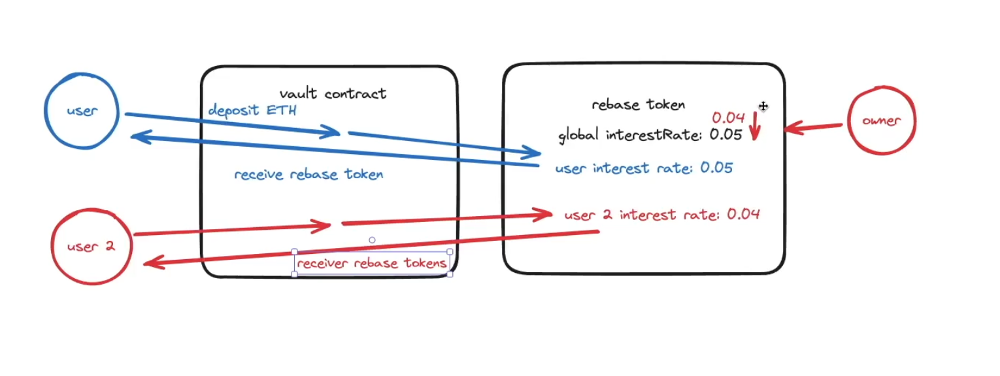

# Cross-chain Rebase Token

1. A protocol that allows user to deposit into a vault and in return, receive rebase tokens that represent their underlying balance.
2. Rebase Token -> balanceOf is dynamic to show the changing balance with time
    - Balance increases linearly with time
    - mint tokens to our users every time they perform an action (minting, burning, transferring, or ... bridging)
3. Interest rate
   - individually set an interest rate for each user based on some global interest rate of the protocol at the time the user deposits into the vault.
   - the global interest rate can only decrease to incentivize/reward early adopters
   - Increase token adoption
 

# Key Mechanisms
1. Interest Accrual: Linear growth over time
2. Virtual Balance: balanceOf() shows balance + interest (not actually minted yet)
3. Lazy Minting: Interest only minted when user interacts with contract
4. Rate Locking: Each user locks in the global rate at deposit time